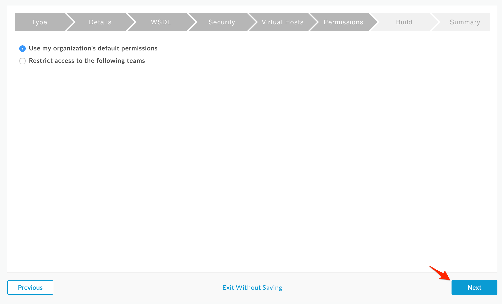

# API Development : Create a RESTful API from a SOAP service

*Duration : 20 mins*

*Persona : API Team*

# Use case

You have are planning on modernising your legacy SOAP based web-services by expose them as RESTful APIs. You are looking for a platform to do this protocol transformation.

# How can Apigee Edge help?

Apigee Edge can consume a WSDL file to extract and convert the SOAP end-points to REST interfaces automatically using the SOAP import wizard. The wizard allows developers to define the new service as a pass-through or expose the service as a RESTful service. You can create two kinds of SOAP proxies in Edge. One generates a RESTful interface to the backend SOAP service and the other performs a "pass through" of the SOAP message to the backend.

In this lab you will see how to convert an existing SOAP interface to REST. The REST to SOAP to REST option processes the WSDL to generate a RESTful API proxy. Edge determines from the WSDL the service's supported operations, input parameters, and so on. Edge "guesses" which HTTP method to use for each operation. Typically, Edge translates operations into GET requests, which have the advantage of being cacheable. Edge also sets up the backend target endpoint, which can vary per SOAP operation.

# Pre-requisites

None.

# Instructions

* Go to [https://apigee.com/edge](https://apigee.com/edge) and log in. This is the Edge management UI.

* Select **Develop → API Proxies** in the side navigation menu.

	

* Click **+Proxy**. The Build a Proxy wizard is invoked.

	

* Select **SOAP service**. Click on **Next**.

  

* Enter details in the proxy wizard.

	* Proxy Name - **{your-initials}**_stockquote

	* Proxy Base Path - /v1/**{your-initials}**_stockquote

  

Note: Replace **{your-initials}** with your initials.

* **Verify** the values and click **Next**.

* Set the API Proxy Type to **REST to SOAP to REST** and click **Next**.

  

* Select **Pass through (none)** for the authorization in order to choose not to apply any security policy for the proxy. Click **Next**.

  

* Go with the **default Virtual Host** configuration.

  

* Ensure that only the **test** environment is selected to deploy to and click **Build and Deploy**

  

* Go with the **default Permission** configuration.

	

* Once API proxy has built and deployed **click** the link to view your proxy in the proxy editor.

  

* You should see the proxy **Overview** screen.

  

* Click on **Expand All** to see the resource endpoints.

	

* *Congratulations!*...You have now built a RESTful API proxy for an existing SOAP backend service.

* Now let’s test the newly built API proxy using the [REST Client](https://apigee-rest-client.appspot.com/). Open the REST Client on a new browser window.  

* Copy the URL for your API proxy.  Also copy the resource name - ```/quote```.  We will use this endpoint to obtain the stock quote for symbol **GOOG** (for Google).

  

* Paste the link on the REST Client and append ```?StockSymbol=GOOG&LicenseKey=0``` to the end of the URL and hit Send.

  

NOTE: You have to append ```/quote``` to the API proxy endpoint and pass ```?StockSymbol=GOOG&LicenseKey=0``` as query parameters.

* You should see a success response similar to this -

  

* Check the **trace** to confirm that the backend is accepting and responding with SOAP messages, while Apigee transparently performs the REST --> SOAP --> REST conversions.

* Now you could try sending different stock symbols and see how this proxy behaves.

For e.g.
```
?StockSymbol=AAPL&LicenseKey=0

?StockSymbol=APIC&LicenseKey=0
```

* That concludes this hands-on lesson. It was simple, but you learned how quickly you were able to convert an existing SOAP service into API without writing a single line of code.

# Lab Video

If you like to learn by watching, here is a short video on creating a reverse proxy [https://youtu.be/gNaoWjbXmpM](https://youtu.be/gNaoWjbXmpM)

# Earn Extra-points

* Now that you have created a RESTful service, switch to Develop tab and review the API proxy. Navigate through different proxy endpoint flows and checkout the policies being used in this proxy.

* Try calling different endpoints of this API - call quick quote and Dataset endpoints passing appropriate query parameters. (Hint - name of the query parameters could be found inside the policy definition).

# Quiz

1. How to get the OpenAPI specification for this newly created proxy?

2. In which flow does Apigee Edge convert the SOAP into JSON?

3. What do you need to do to change the query parameter name from StockSymbol to symbol?

# Summary

In this simple lab you learned how to create a proxy for an existing SOAP backend using Apigee Edge proxy wizard. This feature is really helpful to leverage existing SOA assets and quickly enable them for consumption for mobile and/or HTML5 web applications.

# References

* Useful Apigee documentation links on API Proxies -

    * Build a simple API Proxy for SOAP webservice [http://docs.apigee.com/api-services/content/exposing-soap-service-api-proxy#creatingarestfulapiproxytoasoapbasedservice](http://docs.apigee.com/api-services/content/exposing-soap-service-api-proxy#creatingarestfulapiproxytoasoapbasedservice)

    * Best practices for API proxy design and development - [http://docs.apigee.com/api-services/content/best-practices-api-proxy-design-and-development](http://docs.apigee.com/api-services/content/best-practices-api-proxy-design-and-development)

    * Other policies that are helpful with SOAP are

        * SAML Assertions (Generation & validation) - [http://docs.apigee.com/api-services/reference/saml-assertion-policy](http://docs.apigee.com/api-services/reference/saml-assertion-policy)

        * XSL Transformation - [http://docs.apigee.com/api-services/reference/xsl-transform-policy](http://docs.apigee.com/api-services/reference/xsl-transform-policy)  

* Watch this 4minute video on "Creating REST APIs with SOAP" - [https://youtu.be/awlhrCYtX8A](https://youtu.be/awlhrCYtX8A)  

# Rate this lab

How did you like this lab? Rate [here](https://goo.gl/forms/4elHC2g6EuwnBlon1).
