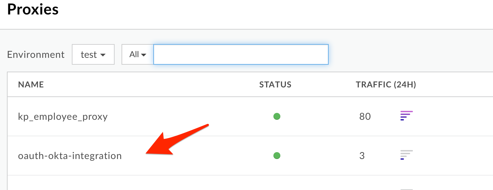
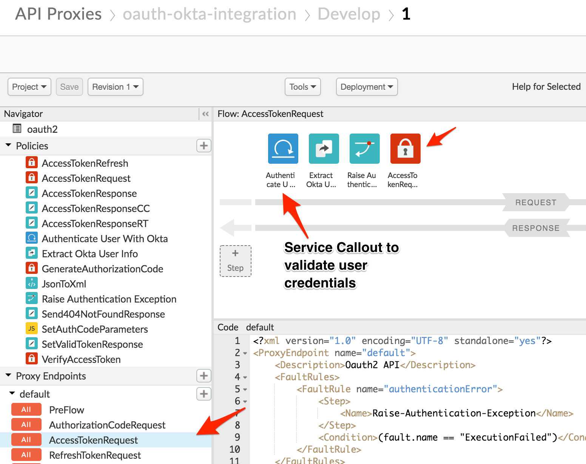
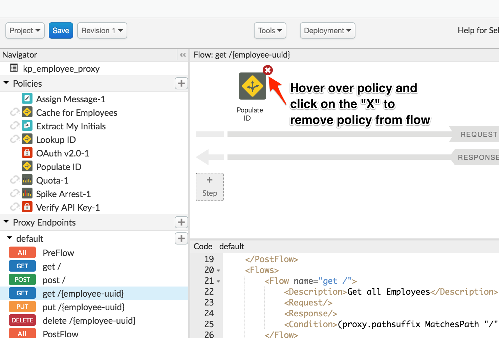
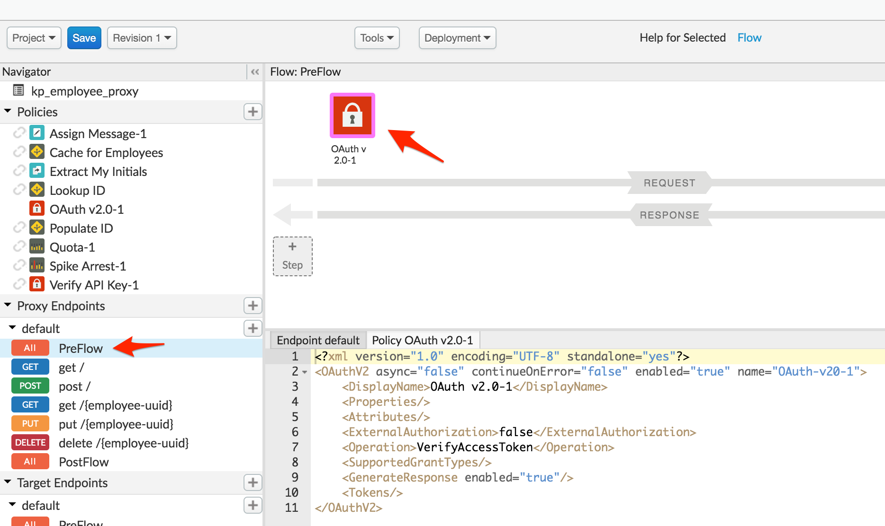
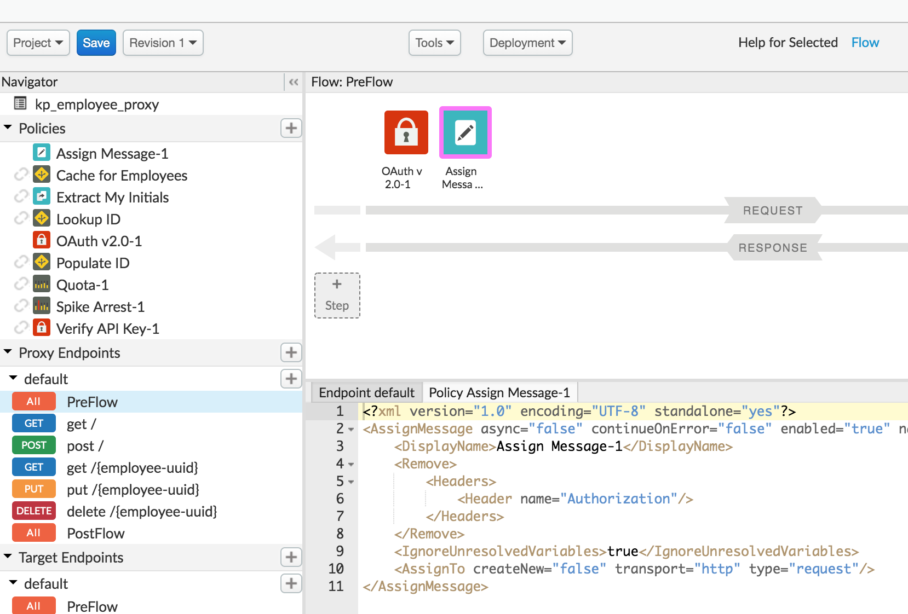

# **API Security - External IdP Integration using Okta**

*Duration : 20 mins*

*Persona : API Team/Security*

# **Use case**

You have an API that is consumed by a client application. You want to secure that API using OAuth 2.0 and use an external identity provider such as Okta, to protect the application end user identity.
In this lab, we will use Apigee as the OAuth provider to protect the API endpoints using OAuth 2.0. Okta will be used to protect the application end user's identity. We will accomplish this by integrating Okta into the Apigee OAuth proxy, and implement OAuth 2.0 in resource owner / password grant type.

# **How can Apigee Edge help?**

See (optional): [Apigee + Okta - Using OAuth 2.0 Resource Owner / Password Grant Type](https://community.apigee.com/articles/28752/apigeeokta-integration-resource-owner-password-gra.html)

Apigee has built in support to implement OAuth 2.0 in the resource owner / password grant type. Using the [OAuthV2 policy](https://docs.apigee.com/api-platform/reference/policies/oauthv2-policy), Apigee Edge can be configured to act as the authorization provider for access to the API, while using the [Service Callout policy](https://docs.apigee.com/api-platform/reference/policies/service-callout-policy) to invoke Okta's authentication API to authenticate the identity of the app end user.


# **Instructions**

Let us assume that there is a client application that needs to consume the API endpoints we built in the previous labs - **Employees**, and that this application is a trusted one.
The resource owner password (or "password") grant type is mostly used in cases where the app is highly trusted. In this configuration, the user provides their resource server credentials (username/password) to the client app, which sends them in an access token request to Apigee Edge. An identity server (it this case, Okta) validates the credentials, and if they are valid, Edge proceeds to mint an access token and returns it to the app.

In this scenario, let us proceed to set up
a) The app end user's identity in Okta,  
b) The app configuration in Apigee Edge, and  
c) The API proxy configuration in Apigee Edge to enforce both end user identity authentication, as well as API authorization through OAuth 2.0.

## End User Configuration in Okta

1. In this lab, we will use a pre-configured Okta instance to authenticate end user identity. First, log in to the Okta instance

* URL: https://mailinatorapigeeoktademo-admin.okta.com

* Username: apigeeoktademo@mailinator.com

* Password: Test123!


2. Click on **Directory --> People**


3. You are presented with a list of people in the okta instance. Add a user to the account by clicking on **Add Person** and filling out the new user details.

For the sake of simplicity, in the **Password** section, select **Set by admin** and **uncheck** the **User must change password on first login** section


Alternatively, you can use the sample user that was created prior:

* Username: alice@example.com

* Password: Test123!

4. Make note of the Username and Password of the user you created. We will use these credentials to authenticate the app end user's identity.

## Review OAuth Token Endpoint

1. Navigate to **Develop -> API Proxies** in the Apigee Edge Management UI


2. A proxy that handles the OAuth integration with Okta has already been created. Select the **oauth-okta-integration** proxy.



2. Navigate into the **develop** tab and select **Proxy Endpoints --> Default --> AccessTokenRequest**. This is the flow we will be using to generate the OAuth token. Take a look at the policies associated to the flow, and note how the OAuth token policy is only triggered after the Okta credentials have been validated.



## Secure the Employee API proxy with OAuth Access Token verification

1. Navigate to **Develop -> API Proxies** in the Apigee Edge Management UI


2. In the API Proxy list, search and select the **{{your_initials}}_employee_proxy**


3. In the proxy develop screen, click into each flow and remove every policy. To remove a policy, hover your cursor over each policy and click on the small **X** that appears to the upper-right of the policy. The goal is to remove all features like authentication and quota-enforcement that we enabled in the previous labs.



4. Select the **Proxy Endpoint --> default --> PreFlow** flow and add an **OAuthV2** policy. You can leave the default configurations as-is, which instructs the policy to validate any inbound OAUth tokens.



5. Next, add an **Assign Message** policy. Leave the default name, and replace the XML configurations for the policy with the one shown below. This configuration will remove the OAuth token from the **Authorization** header after it has been validated.

```
<?xml version="1.0" encoding="UTF-8" standalone="yes"?>
<AssignMessage async="false" continueOnError="false" enabled="true" name="Assign-Message-1">
    <DisplayName>Assign Message-1</DisplayName>
    <Remove>
        <Headers>
            <Header name="Authorization"/>
        </Headers>
    </Remove>
    <IgnoreUnresolvedVariables>true</IgnoreUnresolvedVariables>
    <AssignTo createNew="false" transport="http" type="request"/>
</AssignMessage>
```



5. **Save** the proxy

## Test

Now that we have configured the end user credentials in Okta, and the API Proxy and App credentials in the Apigee Edge, let us proceed to test the OAuth resource owner / password flow end to end.

1. (Optional) Navigate to the proxy overview screen of the "oauth-okta-integration" proxy and  start the **Trace** session:


2. Use the [REST client](https://apigee-rest-client.appspot.com) to send a token request to the OAuth proxy

* URL: https://apijams-amer-1-test.apigee.net/oauth-ext/token

* Method: POST

* **Headers** section

	* Header Name / Value Pairs

		* Accept : application/json

		* Content-Type : application/x-www-form-urlencoded


* **Body** section

	* Select **x-www-form-url-encoded**

	* Parameter Name / Value Pairs

		* grant_type : password

		* user : {{ user account(email) you previously created }}

		* password : {{ password for user you previously created }}

		* client_id : {{ client id for any one of the apps you previously created }}

		* client_secret : {{ client secret for any one of the apps you previously created }}


2. Click on **Send** to trigger the request, and note down the generated access token


Also, note in the Trace session that the Service Callout policy in the "oauth-okta-integration" proxy is called to validate the end user identity in Okta. On successful authentication, the proxy uses the OAuthV2 policy to generate the access token.


3. Now, let us test the "Employee" proxy which we have protected with the OAuthV2 policy.
Navigate to the proxy overview screen of the "Employee" proxy, and start the Trace session

4. Send in a request to the API Proxy without the authorization

* URL: http://apijams-amer-1-test.apigee.net/v1/{{your-initials}}_employee_proxy

* Method: GET

Notice that an error response is returned since the access token was not sent in the request:


5. Now, send in an API request with the access token in the Authorization header:

* **Headers** section

	* Header Name / Value Pairs

		* Authorization : Bearer {{ your previously generated token }}

Once the access token is validated, a successful API response is returned:


## Lab Video

[Apigee/Okta Integration: Resource Owner / Password Grant Flow in Action](https://youtu.be/OKCySDIwZ1E)

## Earn Extra-points
* Try out the okta integration proxy for the delegated token generation case where Okta mints the OAuth access token instead of Apigee, as documented here:
	- [Apigee Community Article](https://community.apigee.com/articles/28752/apigeeokta-integration-resource-owner-password-gra.html)
	- [Proxy](https://github.com/prithpal/apigee-okta-integration)

* Also, see the advanced example for Open ID Connect with Okta, [here](https://github.com/apigee/apigee-okta).

## Summary

In this lab, you have now created an OAuth 2.0 access token endpoint to generate and refresh tokens in the resource owner / password grant type method after validating app end user credetials against an Identity Provider (Okta), and have secured your API such that a valid token must be presented to authorize requests to your API.

## References

* [Implementing the Password Grant Type for OAuth 2.0 on Apigee Edge](https://docs.apigee.com/api-platform/security/oauth/implementing-password-grant-type)

* [OAuthV2 policy cofiguration reference](https://docs.apigee.com/api-platform/reference/policies/oauthv2-policy)
