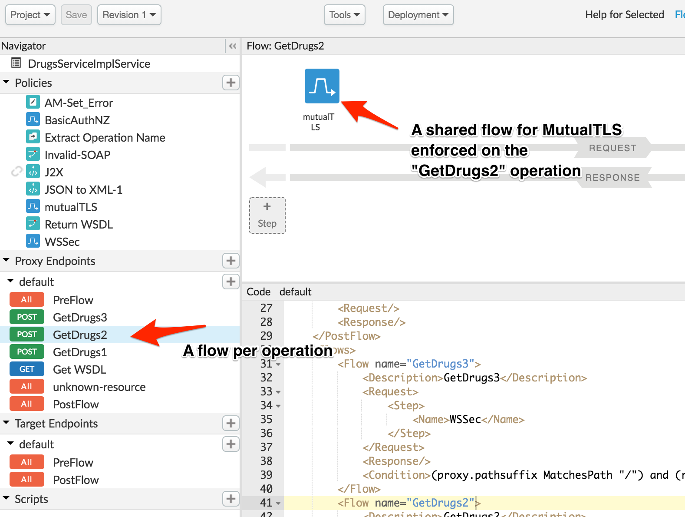

# **API Security - Multiple Authentication Schemes**

*Duration : 20 mins*

*Persona : API Team/Security*

# **Use case**

You have a SOAP Service that is consumed by multiple client applications. The service has multiple SOAP operations, and you would like to enforce different authentication mechanisms per operation.

In this lab, we will use Apigee as a security gateway to protect your service endpoints using WS-Security, HTTP (Basic) Authentication, and mutual TLS.

# **How can Apigee Edge help?**

Apigee has a highly flexible programming model that allows you to customize all sorts of authentication behavior, from which authentication scheme to enforce, as well as when to invoke which scheme.

* Apigee provides a [Basic Authentication policy](https://docs.apigee.com/api-platform/reference/policies/basic-authentication-policy) which can be used to both decode an inbound Basic Authorization header into its username/password components, or conversely, encode a username/password into a base64 encoded string.

* [Mutual TLS](https://docs.apigee.com/api-platform/system-administration/tls-vars), or mTLS for short, is an authentication mechanism that uses client TLS certificates to cryptographically verify the inbound client.

* Apigee also provides extension policies, or policies that enable users to add custom code in the form of [Java](https://docs.apigee.com/api-platform/reference/policies/java-callout-policy), [Javascript](https://docs.apigee.com/api-platform/reference/policies/javascript-policy), or [Python](https://docs.apigee.com/api-platform/reference/policies/python-script-policy).

# **Instructions**

Let us assume that we have a handful of authentication schemes that are used across the enterprise. We want to ensure that these authentication schemes are enforced consistently across the various APIs and services it protects. To achieve this, we leverage [shared flows](https://docs.apigee.com/api-platform/fundamentals/shared-flows). Shared flows allow us to define functionality at a single point, and then re-use that functionality across multiple endpoints. This ensures consistency, shortens development time, and creates more easily managed code.

## View Pharmacy API Proxy

1. Click on **Develop → API Proxies** from side navigation menu.


2. Search for and click the pre-built **pharmacy** proxy.

	

3. Select the **develop** tab, and under **Proxy Endpoints | Default**, note the 3 **POST** flows named **GetDrugs1**, **GetDrugs2**, and **GetDrugs3**. These 3 flows correspond to 3 separate SOAP operations exposed by this proxy. Whenever a request comes in, Apigee will use the inbound SOAPOperation to determine which of the 3 flows to invoke.

Click on all 3 and note that each operation has a different **shared flow** policy attached to it. Each policy enforces a different authentication scheme. They are:

* GetDrugs1 --> Basic (HTTP) Authentication

* GetDrugs2 --> Mutual TLS

* GetDrugs3 --> WS-Sec

  

4. Confirm that security is enforced on each of the SOAP Operations. Click on **trace** and enable a trace session.

Then, use the [REST Client](https://apigee-rest-client.appspot.com/) to send a SOAP request to each of the services.

* Method: POST

* URL: http://apijams-amer-1-test.apigee.net/v1/pharmacy

* Headers

  * Content-Type : text/xml

* Body

  * Select the **raw** radio button

  * Copy / paste the following XML snippet into the body

```
<soapenv:Envelope xmlns:soapenv="http://schemas.xmlsoap.org/soap/envelope/" xmlns:hip="http://hipster">
   <soapenv:Header/>
   <soapenv:Body>
      <hip:GetDrugs1/>
   </soapenv:Body>
</soapenv:Envelope>
```
  * Note the **<hip:GetDrugs1>** tag. Modify it to **<hip:GetDrugs2>** and **<hip:GetDrugs3>** to test out the 2nd and 3rd operation. Regardless of which operation, you should get a **401 Unauthorized** response.


## Basic Authentication - Operation 1

Let's start by verifying Basic Authentication.

1. A sample set of credentials have been generated.

* Basic Auth token: **YWxpY2U6dGVzdFBhc3N3b3Jk**

  * This token was created following the [Basic Authentication](https://en.wikipedia.org/wiki/Basic_access_authentication) standard, and is the base64 encoded representation of the credential set **alice:testPassword**, which has been pre-configured in Apigee

Go back to the REST Client, modify the body to use **Drugs1**, and add the **Authorization** header with value **Basic YWxpY2U6dGVzdFBhc3N3b3Jk**

2. Send the request and confirm you receive a **200** response.


3. Check the trace and see how the **shared flow** executed a pre-configured combination of policies to decode the Basic Auth credentials and validate them.


## Mutual TLS - Operation 2

Let us continue by verifying Mutual TLS.

1. Mutual TLS is enforced at the [virtual host](https://docs.apigee.com/api-platform/fundamentals/virtual-hosts) level. For the purposes of this lab, mutual TLS has already been enabled. Go to this [link](https://apijams-amer-1-test.apigee.net/v1/pharmacy) in a new browser and view the **No required SSL certificate was sent** error.

Note that the URL is the same hostname we were using for Operation 1. The only difference is that we are now coming in over **HTTPS**, and not **HTTP**


2. Next, download the following [cert.pem](https://raw.githubusercontent.com/Enzyme3/apijam/master/Labs/Appendix/API%20Security%20-%20Multiple%20Authentication%20Schemes/resources/cert.pem) and [key.pem](https://github.com/Enzyme3/apijam/blob/master/Labs/Appendix/API%20Security%20-%20Multiple%20Authentication%20Schemes/resources/key.pem) files and save them as **cert.pem** and **key.pem**, respectively. We will be using this keypair to authenticate ourselves.

3. Once downloaded, open up a terminal and run the following curl command
```
curl -X POST --header "Content-Type:text/xml;charset=UTF-8" --data @request2.xml --cert ./cert.pem --key ./key.pem https://apijams-amer-1-test.apigee.net/v1/pharmacy
```

* When prompted for a passphrase, enter **passphrase**


4. Check the **trace** to visualize how the enforcement is taking place.


## WS-Security - Operation 3

We conclude by verifying the WS-Security Authentication. We will be working with an encrypted [Username Token](https://www.oasis-open.org/committees/download.php/13392/wss-v1.1-spec-pr-UsernameTokenProfile-01.htm) with a signed body.

1. Click on **Develop → API Proxies** from side navigation menu.


2. Search for and click the pre-built **wssec** proxy. This proxy will generate an encrypted and signed request for us. Enable tracing on this proxy.


3. This proxy has a **/generate** endpoint that reads in the inbound **username** and **password** query parameters and uses both to create a digitally signed request with an encrypted Username Token. Start a **trace** session and navigate to the below URL to generate the signed request.

```
http://apijams-amer-1-test.apigee.net/wssec/generate?username=alice&password=testPassword
```

Click on the blue **Java Callout policy** to view all of the variables read and assigned by the policy. Locate the **output** variable and copy all of the contents EXCEPT for the leading **<?xml...>** tag.


* We are copying the output from the trace session

4. Re-open up the [REST Client](https://apigee-rest-client.appspot.com/), and send the generated request to the **pharmacy** proxy.

* Method: POST

* URL: http://apijams-amer-1-test.apigee.net/v1/pharmacy

* Headers

  * Content-Type : text/xml

* Body

  * Select the **raw** radio button

  * Paste the previously generated sign/encrypted XML request


5. **trace** the **pharmacy** proxy to view how WS-Security was enforced.


