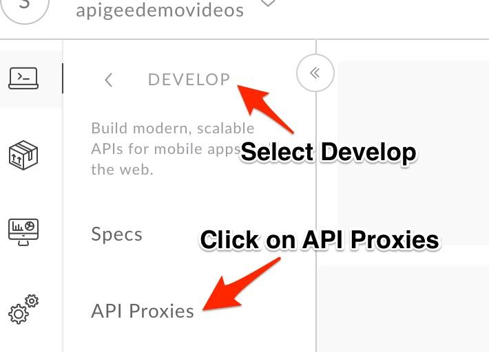

# API Design : Create a Reverse Proxy with OpenAPI Specification

*Duration : 20 mins*

*Persona : API Team*

# Use case

You have a requirement to create a reverse proxy for taking requests from the Internet and forward them to an existing service. You have decided to follow a design first approach & built a reusable component, a specification which can be used to build API Proxies, generate API documentation, generate API test cases using OpenAPI Specification format. You would like to generate an Apigee API Proxy by using the OpenAPI Specification (Swagger) instead of building the API Proxy from scratch.

# How can Apigee Edge help?

Apigee Edge enables you to quickly expose backend services as APIs. You do this by creating an API proxy that provides a facade for the backend service that you want to expose. Apigee Edge out of the box supports the OpenAPI specification, allowing you to auto-generate API Proxies. Apigee Edge also has an OpenAPI specification editor & store which you can use to maintain your OpenAPI specifications. 

The API proxy decouples your backend service implementation from the API that developers consume. This shields developers from future changes to your backend services. As you update backend services, developers, insulated from those changes, can continue to call the API uninterrupted.

In this lab, we will see how to create a reverse proxy, that routes inbound requests to existing HTTP backend services using a readily available OpenAPI specification.

# Part A - Design an API Proxy
## Import an Open API Specification

1. Go to [https://apigee.com/edge](https://apigee.com/edge) and log in. This is the Edge management UI. 

2. Select **Develop → Specs** in the side navigation menu


3. Click **+Spec.** Click on **New** to add a new spec from the UI.

4. Copy the spec details from [here](./resources/yodlee-api-spec.yaml) and paste it on the left pane. 

5. Edit the **basePath** from `/v1` to `/v1/{your_initials}`

6. Hit **Save** on the top right.

   * File Name: **{your-initials}**_yodlee_api_spec

7. Click on **{your-initials}**_yodlee_api_spec from the list to access Open API spec editor & interactive documentation that lists API details & API Resources.

## Create an API Proxy

1. It’s time to create Apigee API Proxy from Open API Specification. Click on **Develop → API Proxies** from side navigation menu.



2. Click **+Proxy** The Build a Proxy wizard is invoked. 


3. Select **Reverse proxy**, Click on **Use OpenAPI** below reverse proxy option.


4. You should see a popup with list of Specs. Select **{your-initials}**_yodlee_api_spec and click **Select.** 

5. You can see the selected OpenAPI Spec URL below the Reverse Proxy option, Click **Next** to continue.


6. Enter details in the proxy wizard. Replace **{your-initials}** with the initials of your name. 

    * Proxy Name: `{your_initials}_accounts_proxy`

    * Proxy Base Path: `/v1/{your_initials}/accounts`

    * Existing API: `https://sandbox.api.yodlee.com/ysl/accounts`


7. Verify the values and click **Next**.

8. You can select, de-select list of API Proxy Resources that are pre-filled from OpenAPI Spec. Select only the `accounts` APIs & Click on **Next**.

9. Select **Pass through (none)** for the authorization in order to choose not to apply any security policy for the proxy. Click Next. 


10. Go with the **default Virtual Host** configuration.


11. Ensure that only the **test** environment is selected to deploy to and click **Build and Deploy**

12. Once the API proxy is built and deployed **click** the link to view your proxy in the proxy editor. 

13. *Congratulations!* ...You have now built a reverse proxy for an existing backend service. You should see the proxy **Overview** screen.


# Part B - Perform API Traffic Mediation
## Add query params to the request
1. Click on the **Preflow** under Proxy endpoints. We will add a new `Extract Variables` policy here to parse out the username coming in the request.

2. Click on the **+ Step** icon to the right in the request flow. From the list, click on the `Extract Variables` policy. Name it **get-username**.

3. Replace the policy configuration with the following:
```
<?xml version="1.0" encoding="UTF-8" standalone="yes"?>
<ExtractVariables async="false" continueOnError="false" enabled="true" name="get-username">
    <DisplayName>get-username</DisplayName>
    <Properties/>
    <URIPath name="name"/>
    <QueryParam name="user">
        <Pattern ignoreCase="true">{username}</Pattern>
    </QueryParam>
    <IgnoreUnresolvedVariables>false</IgnoreUnresolvedVariables>
    <Source clearPayload="false">request</Source>
</ExtractVariables>
```

4. Now let's also create an error handler in case the request doesn't contain a username. Click on the **+ Step** icon to the right in the request flow. From the list, click on the `Raise Fault` policy. Name it **verify-user**. Then replace its configuration with the following:
```
<?xml version="1.0" encoding="UTF-8" standalone="yes"?>
<RaiseFault async="false" continueOnError="false" enabled="true" name="verify-user">
    <DisplayName>verify-user</DisplayName>
    <Properties/>
    <FaultResponse>
        <Set>
            <Headers/>
            <Payload contentType="text/plain"/>
            <StatusCode>400</StatusCode>
            <ReasonPhrase>Please provide the username in the "user" queryparam</ReasonPhrase>
        </Set>
    </FaultResponse>
    <IgnoreUnresolvedVariables>true</IgnoreUnresolvedVariables>
</RaiseFault>
```

5. Finally, navigate to the `Endpoint Default` tab in the editor, and add a condition for the Raise Fault policy that you just created. Replace the existing step with the following:
    ```
    ...
    <Step>
        <Name>verify-user</Name>
        <Condition>(username == null)</Condition>
    </Step>
    ...
    ```

6. Next, let's configure how we would interact with the backend. The Yodlee API requires a JWT, so let's call a shared flow that will handle creating JWT tokens for us. 

    Click on the **Preflow** under **Target** endpoints. We will add a new `Flow Callout` policy here to execute logic in a shared flow that will create a JWT token for us.

    Name it **generate-token**. Then replace its configuration with the following:
    ```
    <?xml version="1.0" encoding="UTF-8" standalone="yes"?>
    <FlowCallout async="false" continueOnError="false" enabled="true" name="generate-token">
        <DisplayName>generate-token</DisplayName>
        <FaultRules/>
        <Properties/>
        <SharedFlowBundle>generate-jwt-token</SharedFlowBundle>
    </FlowCallout>
    ```

7. The backend also requires an Authorization headers with the JWT and a version header. Let's add both the headers next. 

    Click on the **+ Step** icon to the right in the request flow. From the list, click on the `Assign Message` policy. Name it **set-headers**. Then replace its configuration with the following:

    ```
    <?xml version="1.0" encoding="UTF-8" standalone="yes"?>
    <AssignMessage async="false" continueOnError="false" enabled="true" name="add-headers">
        <DisplayName>add-headers</DisplayName>
        <Properties/>
        <Add>
            <Headers>
                <Header name="Authorization">Bearer {jwt-token}</Header>
                <Header name="Api-Version">1.1</Header>
            </Headers>
        </Add>
        <IgnoreUnresolvedVariables>true</IgnoreUnresolvedVariables>
        <AssignTo createNew="false" transport="http" type="request"/>
    </AssignMessage>
    ```

8. Navigate to the shared flow that you added in step 6. You will notice that it caches the JWT for 14 minutes. So, instead of creating a new JWT each time, let's get it from the cache.
        
    Click on the **+ Step** icon to the right in the request flow. From the list, click on the `Lookup Cache` policy. Name it **get-token**. Then replace its configuration with the following:

    ```
    <?xml version="1.0" encoding="UTF-8" standalone="yes"?>
    <LookupCache async="false" continueOnError="false" enabled="true" name="get-token">
        <DisplayName>get-token</DisplayName>
        <Properties/>
        <CacheKey>
            <Prefix>userkey</Prefix>
            <KeyFragment ref="username"/>
        </CacheKey>
        <Scope>Global</Scope>
        <AssignTo>jwt-token</AssignTo>
    </LookupCache>
    ```

    Now drag the policy all the way to the left. This is because you want to check the cache before invoking the flow callout.

9. Finally, let's add a condition to the `generate token` step so that we only invoke it when our cache is empty.

    Navigate to the `Endpoint Default` tab in the editor after selecting `preflow` in the default `target endpoint`, and add a condition for the Flow Callout policy. Replace the existing step with the following:
    
    ```
    ...
        <Step>
            <Name>generate-token</Name>
            <Condition>(jwt-token == null)</Condition>
        </Step>
    ...
    ```

6. Click **save** on the top left to save the proxy. You have just made a fully working API Proxy!

## Test the API Proxy
1. Click on the **`Trace`** button on the top right of the proxy editor.

2. It should automatically paste the url of your proxy in the text field. If not, use the url `https://apijams-amer-8-test.apigee.net/v1/{your_initials}/accounts?user=sbMem5c44dadc7f7ea2`

3. Click on the **Trace** button to start tracing calls.

4. Hit **Send**.

5. Inspect the trace on the screen.

## Save the API Proxy

1. Let’s save the API Proxy locally as an API Bundle so that we can reuse it in other labs.

2. Save the API Proxy by downloading the proxy bundle, See screenshot below for instructions.


# Quiz

1. How do you import the proxy bundle you just downloaded? 
2. How does Apigee Edge handle API versioning? 
3. Are there administrative APIs to create, update or delete API proxies in Apigee?

# Summary

That completes this hands-on lesson. In this simple lab you learned how to create a proxy for an existing backend using OpenAPI Specification and Apigee Edge proxy wizard.

# References

* Useful Apigee documentation links on API Proxies - 

    * Build a simple API Proxy - [http://docs.apigee.com/api-services/content/build-simple-api-proxy](http://docs.apigee.com/api-services/content/build-simple-api-proxy) 

    * Best practices for API proxy design and development - [http://docs.apigee.com/api-services/content/best-practices-api-proxy-design-and-development](http://docs.apigee.com/api-services/content/best-practices-api-proxy-design-and-development) 

* Watch this 4minute video on "Anatomy of an API proxy" - [https://youtu.be/O5DJuCXXIRg](https://youtu.be/O5DJuCXXIRg) 

# Rate this lab

Now go to [Lab-2](../Lab%202%20Traffic%20Management%20-%20Throttle%20APIs)

