# Security : Throttle APIs

*Duration : 10 mins*

*Persona : API Team / Security*

# Use case

You have a requirement to create a reverse proxy for taking requests from the Internet and forward them to an existing service. You have decided to follow a design first approach & built a reusable component, a specification which can be used to build API Proxies, generate API documentation, generate API test cases using OpenAPI Specification format. You would like to generate an Apigee API Proxy by using the OpenAPI Specification (Swagger) instead of building the API Proxy from scratch.
Also, you have an additional requirement to protect your target servers (backend) from traffic spikes. You would like to protect your APIs from denial of service attacks that might lead to performance lags or downtime of your backend.

# How can Apigee Edge help?

By exposing an API through Apigee Edge, you gain the ability to modify and monitor its behavior using out-of-the-box policies. Edge's out-of-the-box policies enable you to enhance your API with sophisticated features to control traffic, enhance performance, enforce security, and increase the utility of your APIs, without requiring you to write any code or to modify any backend services. Extension policies enable you to implement custom logic in the form of JavaScript, Python, Java, and XSLT.

In this lab we will see how to use an out of the box traffic management policy, "Spike Arrest", to protect against traffic spikes. A Spike Arrest policy can throttle the number of requests processed by an API proxy and sent to a backend, protecting against performance lags and downtime.

# Pre-requisites

* Basic understanding of [OpenAPI Specification](https://github.com/OAI/OpenAPI-Specification) (Swagger)
* Completed a previous [Virtual API Jam](https://github.com/rmistry75/devjam3/tree/master/Labs/VirtualAPIJam) or have the equivalent knowledge

# Instructions

1. Go to [https://apigee.com/edge](https://apigee.com/edge) and log in. This is the Edge management UI. 

2. Select **Develop → Specs** in the side navigation menu

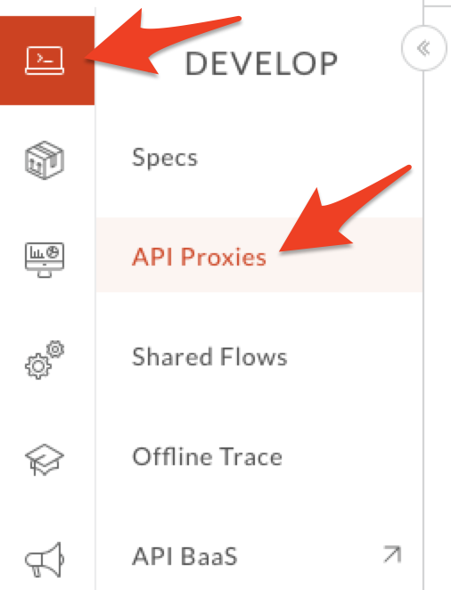

3. Click **+Spec.** Click on **Import URL** to add a new spec from existing source.


4. Enter spec details. Replace **{your-initials}** with the initials of your name.

   * File Name: **{your-initials}**_employee_api_spec

   * URL: [http://playground.apistudio.io/070cde0a-44f7-4e2c-8085-6e1020db7baf/spec](http://playground.apistudio.io/070cde0a-44f7-4e2c-8085-6e1020db7baf/spec)

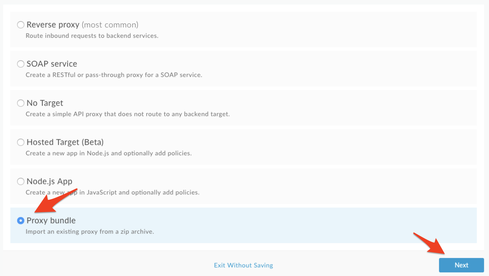

5. Verify the values and click **Import**. Spec has been imported into Apigee Edge & Ready to use. You should see your spec in the list. For example,

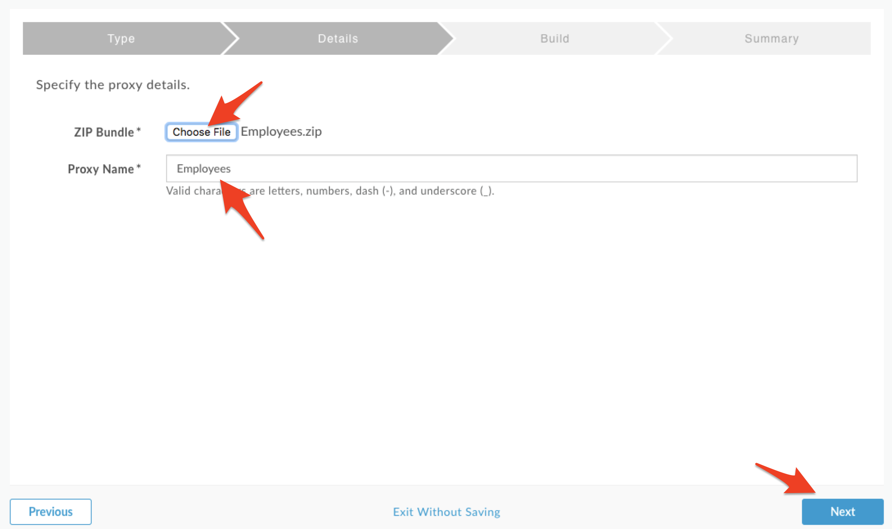

6. Click on **{your-initials}**_employee_api_spec from the list to access Open API spec editor & interactive documentation that lists API details & API Resources.

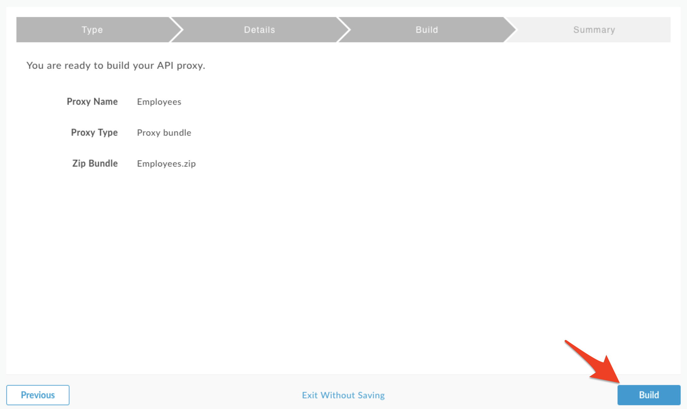

## Create an API Proxy

1. It’s time to create Apigee API Proxy from Open API Specification. Click on **Develop → API Proxies** from side navigation menu.


2. Click **+Proxy** The Build a Proxy wizard is invoked. 


3. Select **Reverse proxy**, Click on **Use OpenAPI** below reverse proxy option.

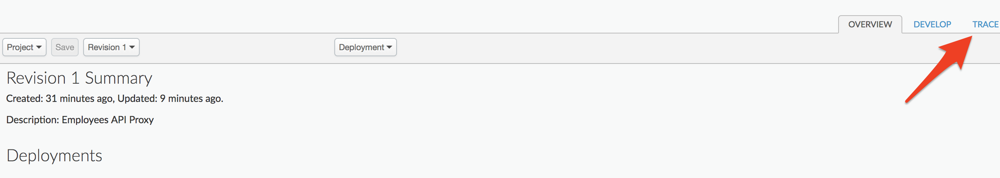

4. You should see a popup with list of Specs. Select **{your-initials}**_employee_api_spec and click **Select.** 

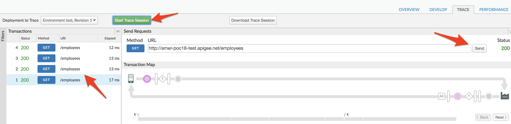

5. You can see the selected OpenAPI Spec URL below the Reverse Proxy option, Click **Next** to continue.

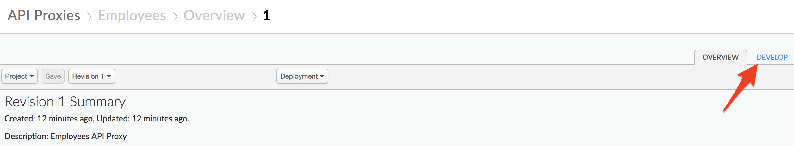

6. Enter details in the proxy wizard. Replace **{your-initials}** with the initials of your name. 

    * Proxy Name: **{your_initials}**_employee_proxy

    * Proxy Base Path: /v1/**{your_initials}**_employee_proxy

    * Existing API: Observe the field value which is auto filled from OpenAPI Spec.

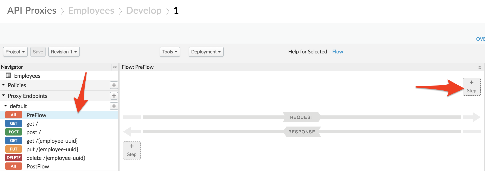

7. Verify the values and click **Next**.

8. You can select, de-select list of API Proxy Resources that are pre-filled from OpenAPI Spec. Select all & Click on **Next**

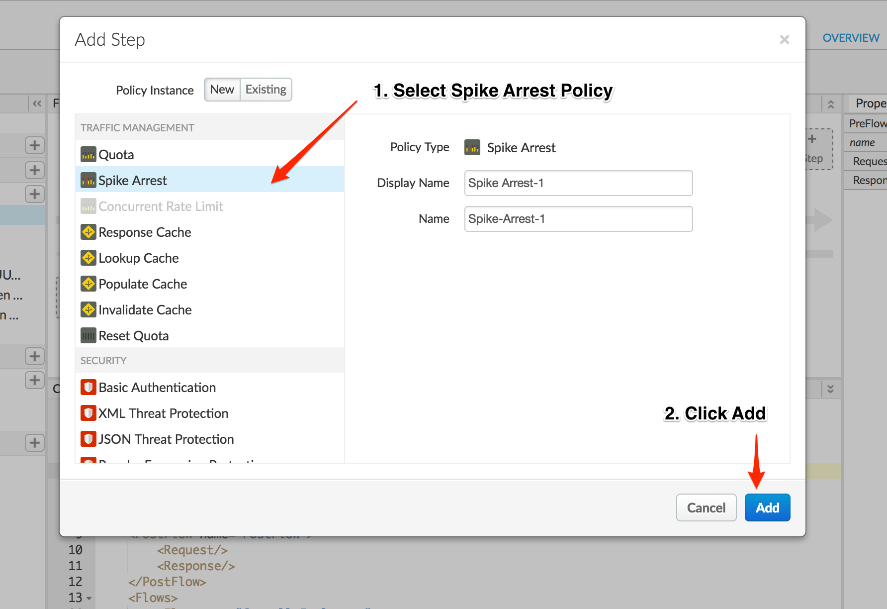

9. Select **Pass through (none)** for the authorization in order to choose not to apply any security policy for the proxy. Click Next. 


10. Go with the **default Virtual Host** configuration.


11. Ensure that only the **test** environment is selected to deploy to and click **Build and Deploy** 


12. Once the API proxy is built and deployed **click** the link to view your proxy in the proxy editor. 


13. *Congratulations!* ...You have now built a reverse proxy for an existing backend service. You should see the proxy **Overview** screen.


## Test the API Proxy
1. Let us test the newly built API proxy using the [REST Client](https://apigee-rest-client.appspot.com/). Open the REST Client on a new browser window.  

2. Copy the URL for your API proxy. 


3. Paste the link into the REST Client and make a GET call


4. You should see a success response similar to this -


## Add Rate Limiting to the API Proxy
1. Select **Develop → API Proxies** in the side navigation menu.


2. Click on **{your_initials}**_employee_proxy that you have created in earlier lab exercise.


3. Click on **Develop** tab to access API Proxy development dashboard.


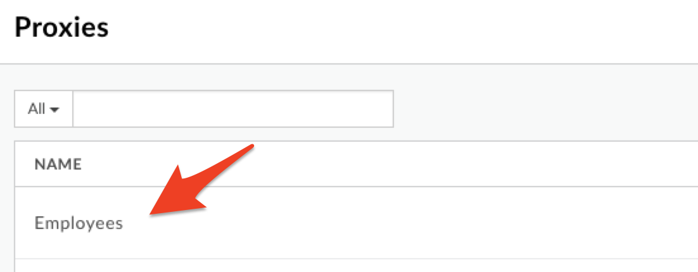

4. Click on **PreFlow** under Proxy Endpoint default, Click on **+Step** on top of Request flow to attach a spike arrest policy.


5. Select **Spike Arrest Policy**. Click on **Add** button to add spike arrest policy to proxy endpoint preflow request.


6. You can notice Spike Arrest policy icon on top of request flow that shows where exactly policy is attached and policy XML configuration below in editor.


7. Change the Policy XML configuration to below code & update the rate to 12pm.
```
<?xml version="1.0" encoding="UTF-8" standalone="yes"?>
<SpikeArrest async="false" continueOnError="false" enabled="true" name="Spike-Arrest-1">
    <DisplayName>Spike Arrest-1</DisplayName>
    <Properties/>
    <Rate>12pm</Rate>
    <UseEffectiveCount>true</UseEffectiveCount>
</SpikeArrest>
```

Think of Spike Arrest as a way to generally protect against traffic spikes rather than as a way to limit traffic to a specific number of requests. Your APIs and backend can handle a certain amount of traffic, and the Spike Arrest policy helps you smooth traffic to the general amounts you want.

The runtime Spike Arrest behavior differs from what you might expect to see from the literal per-minute or per-second values you enter.

For example, say you enter a rate of 6pm (6 requests per minute). In testing, you might think you could send 6 requests in 1 second, as long as they came within a minute. But that's not how the policy enforces the setting. If you think about it, 6 requests inside a 1-second period could be considered a mini spike in some environments.

What actually happens, then? To prevent spike-like behavior, Spike Arrest smooths the number of full requests allowed by dividing your settings into smaller intervals:

* **Per-minute** rates get smoothed into full requests allowed in intervals of **seconds**. For example, 6pm gets smoothed like this: 60 seconds (1 minute) / 6pm = 10-second intervals, or 1 request allowed every 10 seconds. A second request inside of 10 seconds will fail. Also, a 7th request within a minute will fail.

* **Per-second** rates get smoothed into full requests allowed in intervals of **milliseconds**. For example, 10ps gets smoothed like this: 1000 milliseconds (1 second) / 10ps = 100-millisecond intervals, or 1 request allowed every 100 milliseconds. A second request inside of 100ms will fail. Also, an 11th request within a second will fail.

8. Click on **Save** to save the API Proxy changes.


*Congratulations!*...You have now secured your backend against denial of service attacks, performance lags or downtime of target servers.

## Test the API policy configuration

1. Let us test the updated API proxy using the Trace Console. Click on **Trace** tab.


2. Click on **Start Trace Session** to see API Proxy with spike arrest in action.


3. Click on **Send** button multiple times, You will see 500 response code when spike arrest policy kicks in to protect target servers from spike in traffic.


4. You might notice that number of requests with 200 response is more than spike arrest rate value configured, It’s due to multiple message processors where policies gets executed and each has individual counters.

5. You can also use [Apigee Rest Client](https://apigee-rest-client.appspot.com/) to test Spike Arrest Policy.

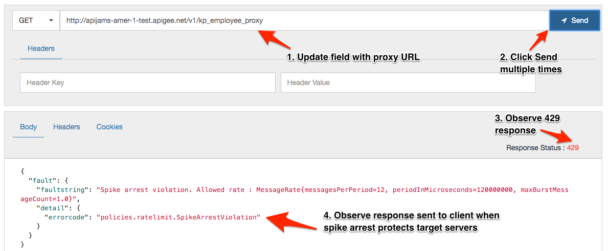

# Lab Video

If you like to learn by watching, here is a short video on using Spike Arrest policy. [https://youtu.be/3Gi-GGTqllg](https://youtu.be/3Gi-GGTqllg)

# Earn Extra-points

Now that you have protected your backend against spike in traffic, Explore more about spike arrest policy using docs here, [http://docs.apigee.com/api-services/reference/spike-arrest-policy](http://docs.apigee.com/api-services/reference/spike-arrest-policy) & update the policy with identifer like queryparam on which spike arrest counter is updated. Use message weight property to assign a weight to the counter.

# Quiz

1. Assume there is a single message processor, Spike Arrest rate limit is 2 pm, What is the interval of time in which a single API Request is allowed to reach target server ?

2. Is it possible to implement spike arrest based on run time variables like per developer / per app ?

# Summary

That completes this hands-on lesson. In this simple lab you learned how to protect target servers against denial of service attacks.

# References

* Useful Apigee documentation links on Traffic Management & Spike Arrest Policy  - 

    * Spike Arrest Policy - http://docs.apigee.com/api-services/reference/spike-arrest-policy

    * Rate Limiting - [http://docs.apigee.com/api-services/content/rate-limiting](http://docs.apigee.com/api-services/content/rate-limiting)

    * Comparing Rate Limiting Policies - [http://docs.apigee.com/api-services/content/comparing-quota-spike-arrest-and-concurrent-rate-limit-policies](http://docs.apigee.com/api-services/content/comparing-quota-spike-arrest-and-concurrent-rate-limit-policies) 

# Rate this lab

How did you like this lab? Rate [here](https://goo.gl/forms/oivm4A6DqBKM9AEJ3).

Now go to [Lab-3](https://github.com/apigee/devjam3/tree/master/Labs/Core/Lab%203%20API%20Diagnostics%20-%20Trace%20tool)
