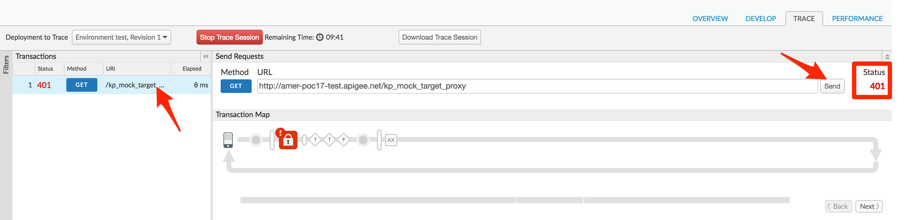

# API Security : Securing APIs with API Key

*Duration : 10 mins*

*Persona : API Team*

# Use case

You have an API Proxy that you want to secure, so that you can manage access and perform business logic based on the client making the call.  In addition authorizing users, you want to know which Developer App is making calls so you can leverage that data to customize your API behavior based on the entitlement level of the caller, or even the specific caller.  You also would like to be able to see who is calling your API Proxies in your Analytics dashboards.

# How can Apigee Edge help?

The [Verify API Key Policy](http://docs.apigee.com/api-services/reference/verify-api-key-policy) in Edge authenticates that the call is coming from an approved application in a valid state.  App developers who wish to access secure operations must request [API keys](http://docs.apigee.com/api-services/content/api-keys) for their apps via the developer portal.

In addition to authenticating requests, the [Verify API Key Policy](http://docs.apigee.com/api-services/reference/verify-api-key-policy) provides context about who is making the call.  This context can be used to apply policies such as Quota management or routing based on the client app.  Upon successful verification of the API Key, the API Context is populated with details about the App, Developer, and API Product associated with the call.  This data can be used for applying business logic as well as gaining business insights through analytics.

In this lab, you will protect an existing API Proxy with the [Verify API Key Policy](http://docs.apigee.com/api-services/reference/verify-api-key-policy) and use the trace tool to see the policy in action.  To accomplish this you will modify an existing API Proxy to add a security policy to handle the authorization.  

# Instructions

## Invoke an API Proxy to secure

* Click **Start Trace Session** to begin a trace session.

* Click **Send** to send a request.

* You should see a successful 2xx response for your API Call.

* This means that this API is open to the entire world to use. We'd rather only expose it to our limited consumers. Let's do that using the `Verify API Key` policy.

## Add a Verify API Key Policy

* Menu: **Develop > API Proxies**

* Open your API Proxy and click the **Develop** tab (in the upper right area of the page) to see the flow editor (you may have to move the panes to see the full request and response flow lines)

* Click on **Preflow**. Then Click **+ Step** on the request flow and select *Verify API Key* policy from the *Security* section of the list.  The name can be changed or left at the default.

* Click **Add**

* The policy will be added after any policies you previously had in the Request flow.  Since we likely want this to occur first, drag the new policy to be the leftmost.

* With the *Verify API Key* policy selected, you can see its configuration (the default policy configuration is below).  Note that the API Key is being retrieved from the context as the variable *request.queryparam.apikey*.  This is the default but the policy can be configured to retrieve the key from any request parameter key you prefer, such as header or body.

```
<?xml version="1.0" encoding="UTF-8" standalone="yes"?>
  <VerifyAPIKey async="false" continueOnError="false" enabled="true" name="Verify-API-Key-1">
    <DisplayName>Verify API Key-1</DisplayName>
     <Properties/>
    <APIKey ref="request.queryparam.apikey"/>
</VerifyAPIKey>
```

* **Save** the API Proxy.

* Click the **Trace** tab near the top of the window.

* Click **Start Trace Session** to begin a trace session.

* Click **Send** to send a request.  

* You should see a 401 (unauthorized) response for your API Call because the API Proxy was expecting an API Key as a query parameter.  See the trace session below

* NOTE: In a later lab, you will get an API Key that will allow you to make this API call successfully.



# Quiz

1. Why is the Verify API Key policy typically found as the first policy in the Request PreFlow?  When might it be in a conditional PreFlow instead of the "All" PreFlow?

2. How would you configure the policy to get the API Key from a header called "Api-Key" instead of the default query parameter location?

# Summary

In this lab you learned how to protect your API Proxy using the Verify API Key policy.  You implemented the policy and tested it using the built-in Trace Tool.

# References

* Link to Apigee docs page

    * Verify Api Key Policy [http://docs.apigee.com/api-services/reference/verify-api-key-policy](http://docs.apigee.com/api-services/reference/verify-api-key-policy)
