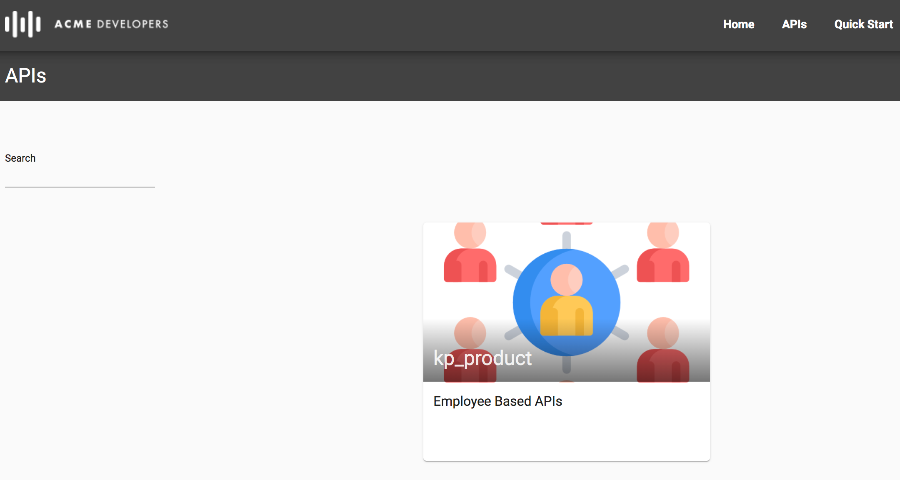

# API Publishing : Consume APIs

*Duration : 20 mins*

*Persona : Developer*

# Use case

As an App Developer you would like to learn about APIs exposed by the API Team using API Documentation. Register in API Program to get access to the APIs exposed by the API Team.

# How can Apigee Edge help?

Apigee Edge has out of the box lightweight Developer Portal which allows API Team to publish API Documentation & as an App Developer you can self register onto API Platform. Once logged in, you can create Apps to get API Keys using which you can access APIs securely.

In this lab, we will see how to register as an App Developer, navigate through API documentation, create app in the Developer Portal to access API keys, test the APIs using the keys we got from Developer Portal.

# Pre-requisites

Secure APIs with API Keys, Publishing API Documentation lab exercises. If not, jump back to *API Security - Securing APIs with API Keys* lab.

# Instructions

## Open Your Portal

1. Go to [https://apigee.com/edge](https://apigee.com/edge) and log in. This is the Edge management UI.

2. Select **Publish → Portals** in the side navigation menu.

3. Click on **{your_initials}_{api_proxy_name}_portal** that you have created in earlier lab exercise.

4. Click on **Live Portal** link to access Developer Portal to start interacting as Developer persona.

## Gain Access to API Documentation

1. In this lab, we will play the role of App Developer who would like to access the APIs and API Documentation.

2. Let’s register as an App Developer by clicking on the **Sign In** link.

3. Click on **Create account**.

4. Fill in the details, and click on **Create account**.

5. As message indicates, check your inbox for the account verification link.

6. Click on verification link in your inbox, which will once again direct you to the portal. Once you log in with the newly created credentials, your email address will appear in the top-right corner, which indicates that you are logged in.

7. Click on the **APIs** link and then click on **{your_initials}_product** category to access API Documentation.

8. Go through API Documentation and understand the API Request and Response.

## Register a New App

Typically, developers who want to consume APIs go to developer portal and register to use them. When registering, the developer gets to select which of API products he or she wishes to use. For example, some products may be offered for free, while others require payment depending on a service plan. Upon completion, this registration step produces an Edge entity called a **developer app**. A developer app includes the products the developer selected and a set of API keys that the developer will be required to use to access the APIs that are associated with those products.

1. To Create an App, Click on **Email Address** & then **My Apps** in top menu bar.

2. Click on **+ New App** to create an App.

3. Update App Name & Description, toggle the Product to enable access, and then click on **Create** button to create a new App.

**Congratulations** You have successfully created an app! Note the generated API key which can be used to make secured API Calls.

# Lab Video

If you like to learn by watching, here is a short video on consuming APIs using Apigee Developer Portal [https://youtu.be/nCJwlVF6waw](https://youtu.be/nCJwlVF6waw)

# Earn Extra-points

Now that you have Registered in Developer Portal, Created App, Read API Documentation, Explore more by making an API call using keys generated above.

# Quiz

1. When you create an APP, What are the different keys associated with it ?

2. Is it possible to create different Apps with same App Name ?

3. Is it possible to associate multiple API Products with same App ?

# Summary

That completes this hands-on lesson. In this simple lab you learned how to self register as a Developer to access APIs, Create Apps, Access API Keys, Navigate through API Documentation.

# References

* Useful Apigee documentation links on Apigee Developer Portal.

    * Apigee Developer Portal , [https://docs-new.apigee.com/portal](https://docs-new.apigee.com/portal)

# Rate this lab

How did you like this lab? Rate [here](https://goo.gl/forms/H4qE5nLy36yWjj642).

Now go to [Lab-8](https://github.com/Enzyme3/apijam/tree/updateForMI/Labs/Core/Lab%208%20API%20Analytics%20-%20Custom%20Reports)
