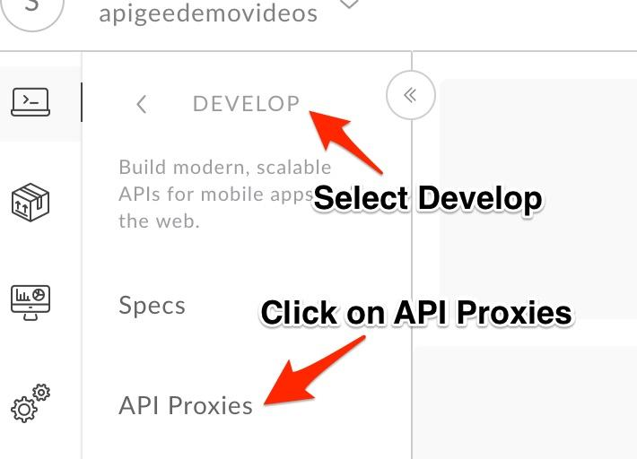
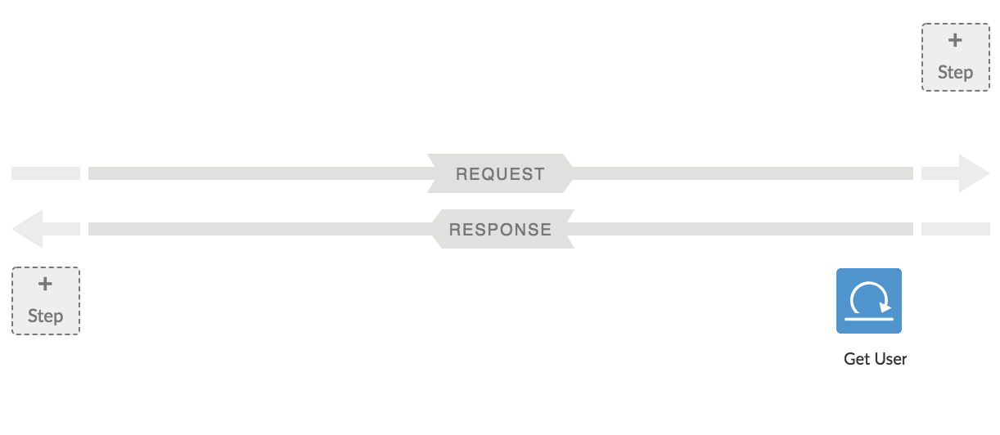
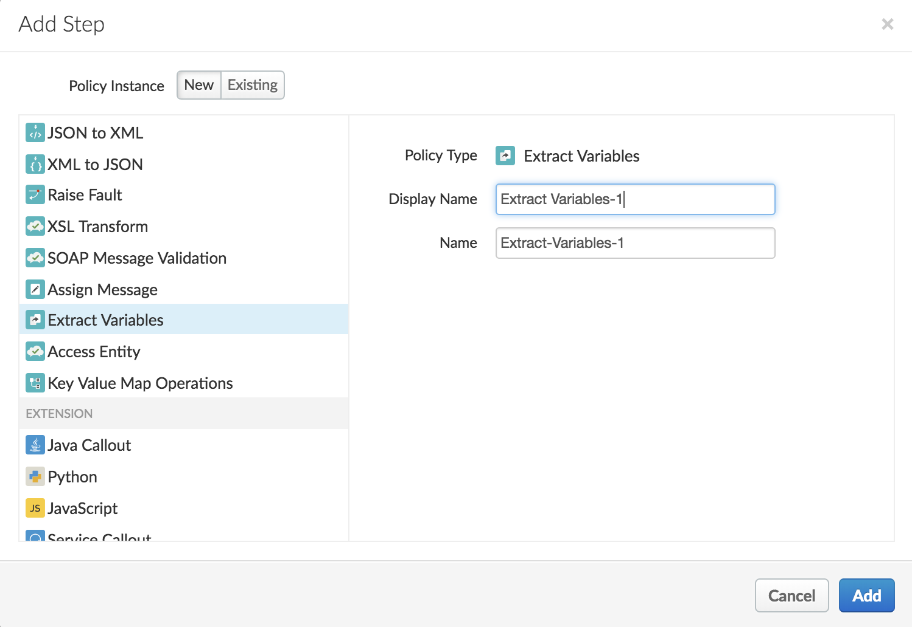
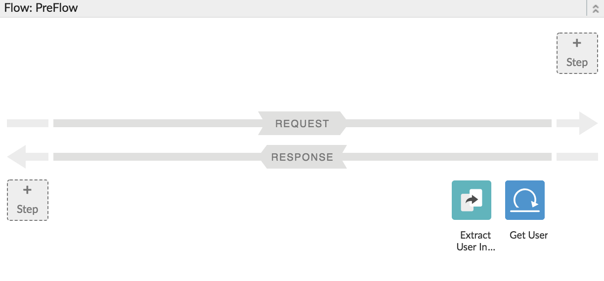
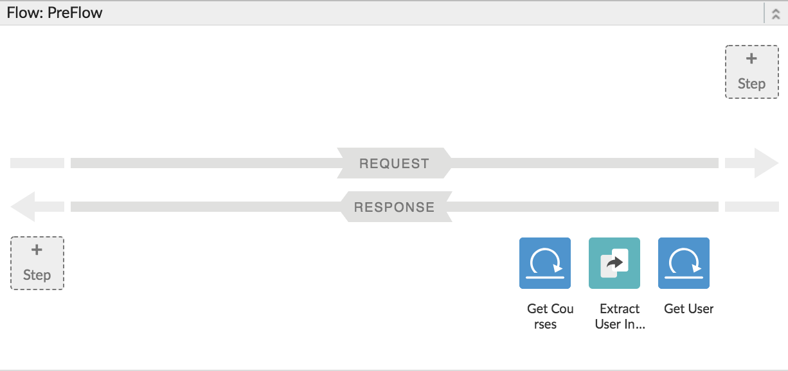
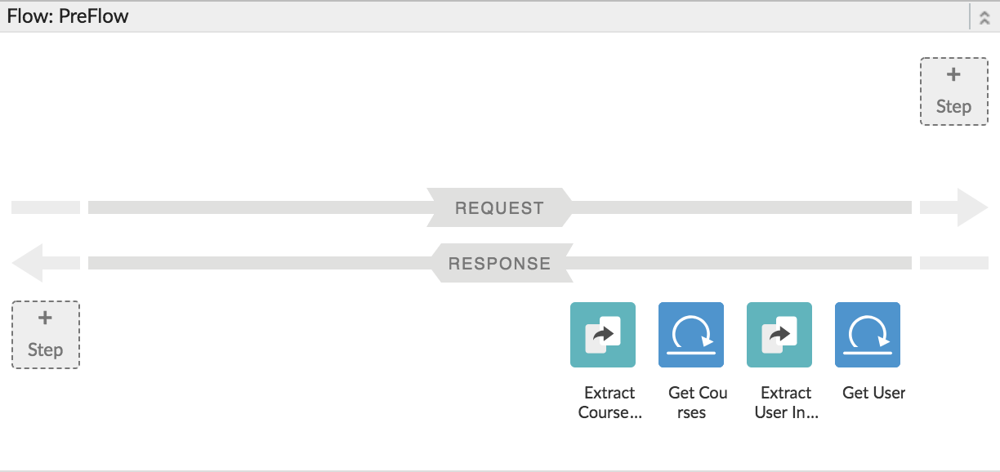
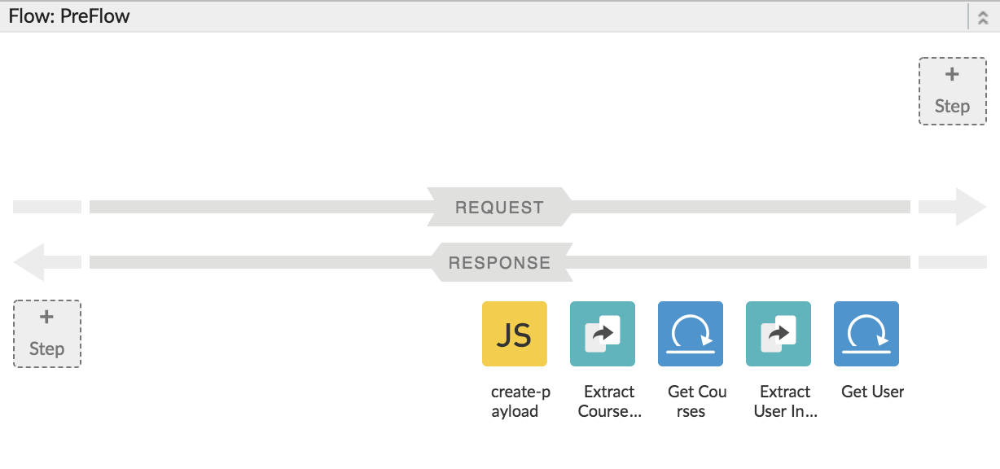

# API Development : Create a Mashup with APIs (Composite APIs)

*Duration : 20 mins*

*Persona : API Team*

# Use case

As a member of the API team, you would like to aggregate multiple APIs, in this case the user API and course API, into a single interface for ease of consumability for your App Developers when searching for users along with the courses they have completed.

We would like to create an API to display badges for users that have completed certain courses. For this, we need an API that gives us some basic user information like id, first name and last name along with a list of courses they have completed.
In essence, we want to extract the relevant information from `/users/<userId>/courses` and `/users/<userId>` APIs and present it to the developer.

# Instructions

## Create a new Proxy with no target backend

1. Go to [https://apigee.com/edge](https://apigee.com/edge) and log in. This is the Edge management UI. 

2. Select **Develop → API Proxies** in the side navigation menu.



3. Click on **+ Proxy** on the top right.

4. In the dialog box, select **No Target**. Here, we won't be accessing a target backend. Instead, we will make some service callouts to get our data.

4. Click **Next** and choose a unique proxy name. For basepath, type **{your_initials}**_user-badges

5. Click **Next** and select **Pass Through** for Authorization.

6. Keep clicking **Next** and deploy the proxy to **test**. Then click on the link on the last tab to access the API.

## Create multiple service callout requests and orchestrate their outpus to prepare the response for our API.

1. Click on **+ Step** on PreFlow **Response** Flow, and select the **Service Callout** policy.


2. Replace its configuration with below:
```
<?xml version="1.0" encoding="UTF-8" standalone="yes"?>
<ServiceCallout name="getUsers">
    <DisplayName>Get User</DisplayName>
    <Request variable="userInfoRequest">
        <Set>
            <Verb>GET</Verb>
            <QueryParams>
                <QueryParam name="apikey">4F1D0552-A887-427A-904D-7F08D94CDF05</QueryParam>
                <QueryParam name="source">googletest</QueryParam>
                <QueryParam name="format">json</QueryParam>
            </QueryParams>
        </Set>
        <IgnoreUnresolvedVariables>false</IgnoreUnresolvedVariables>
    </Request>
    <Response>userInfo</Response>
    <Timeout>30000</Timeout>
    <HTTPTargetConnection>
        <URL>https://apibeta.litmos.com/v1.svc/users/{request.queryparam.userId}</URL>
    </HTTPTargetConnection>
</ServiceCallout>
```

Your preflow should look like below:


3. Click on **+ Step** on PreFlow **Response** Flow, and select the **Extract Variables** policy.


4. Replace its configuration with below:
```
<?xml version="1.0" encoding="UTF-8" standalone="yes"?>
<ExtractVariables async="false" continueOnError="false" enabled="true" name="user-info">
    <DisplayName>Extract User Info</DisplayName>
    <Properties/>
    <IgnoreUnresolvedVariables>true</IgnoreUnresolvedVariables>
    <JSONPayload>
        <Variable name="id">
            <JSONPath>$.Id</JSONPath>
        </Variable>
        <Variable name="username">
            <JSONPath>$.UserName</JSONPath>
        </Variable>
        <Variable name="firstname">
            <JSONPath>$.FirstName</JSONPath>
        </Variable>
        <Variable name="lastname">
            <JSONPath>$.LastName</JSONPath>
        </Variable>
    </JSONPayload>
    <Source clearPayload="false">userInfo</Source>
</ExtractVariables>
```

Here's a brief description of the elements that were modified in this policy. You can read more about this policy in [Extract Variables policy](http://apigee.com/docs/api-services/reference/extract-variables-policy).

Now, your preflow should look like below:


5. Again, click on **+ Step** on PreFlow **Response** Flow, and select the **Service Callout** policy.

6. Replace its configuration with below:
```
<?xml version="1.0" encoding="UTF-8" standalone="yes"?>
<ServiceCallout name="Get-Courses">
    <DisplayName>Get Courses</DisplayName>
    <Request variable="courseInfoRequest">
        <Set>
            <Verb>GET</Verb>
            <QueryParams>
                <QueryParam name="apikey">4F1D0552-A887-427A-904D-7F08D94CDF05</QueryParam>
                <QueryParam name="source">googletest</QueryParam>
                <QueryParam name="format">json</QueryParam>
            </QueryParams>
        </Set>
        <IgnoreUnresolvedVariables>false</IgnoreUnresolvedVariables>
    </Request>
    <Response>courseInfo</Response>
    <Timeout>30000</Timeout>
    <HTTPTargetConnection>
        <URL>https://apibeta.litmos.com/v1.svc/users/x16TDks_Osg1/courses</URL>
    </HTTPTargetConnection>
</ServiceCallout>
```
Your preflow should look like below:


7. Again, click on **+ Step** on PreFlow **Response** Flow, and select the **Extract Variables** policy.

8. Replace its configuration with below:
```
<?xml version="1.0" encoding="UTF-8" standalone="yes"?>
<ExtractVariables async="false" continueOnError="false" enabled="true" name="getCourses">
    <DisplayName>Extract Course Info</DisplayName>
    <Properties/>
    <IgnoreUnresolvedVariables>true</IgnoreUnresolvedVariables>
    <JSONPayload>
        <Variable name="courses">
            <JSONPath>$</JSONPath>
        </Variable>
    </JSONPayload>
    <Source clearPayload="false">courseInfo</Source>
</ExtractVariables>
```
Your preflow should look like below:


9. Finally, click on **+ Step** on PreFlow **Response** Flow, and select the **Javascript** policy. Here we'll prepare the response using the results from the previous two callouts.

Update the default display name to **Prepare Response** select *Create New Script* and then name it **prepare-response.js**


10. Open the script file `prepare-response.js` and add in the following javascript code:
```
var id = context.getVariable('id');
var username = context.getVariable('username');
var firstname = context.getVariable('firstname');
var lastname = context.getVariable('lastname');
var courses = JSON.parse(context.getVariable('courses'));

var completedCourses = [];

for (var x = 0; x < courses.length; x++) {
    if (courses[x].Complete) {
        completedCourses.push({
            Id: courses[x].Id,
            Name: courses[x].Name
        })
    }
}

var res = {
    Id: id,
    UserName: username,
    FirstName: firstname,
    LastName: lastname,
    badges: completedCourses
};

response.headers["Content-Type"] = "application/json";
response.content.asJSON = res;

```
Now, your preflow should look like below:


11. Save your proxy and deploy it to **test**.

12. Head over to the **trace** tab and start a trace session. Make a request to the following path: http://apijams-amer-10-test.apigee.net/**{your_initials}**_user-badges?userId=x16TDks_Osg1

Inspect the response. You will see that we have successfully orchestrated over two APIs to prepare our response. You can similarly do this with any number of APIs.

# Summary

That completes the policy oriented approach to build composite APIs. You learned how to use a variety of transformation and extensibility policies to a proxy to create an API facade that has a more consumable interface than the raw backend target endpoint interface. You also learned how to call external services within the flow using the Service Callout extensibility policy and to use the results to augment the request to the target endpoint. You also learned how to quickly incorporate Javascript code to transform and manipulate data before sending it to the API consumer. Alternatively you can achieve this by using programmability feature of Apigee Edge to implement this functionality.

Common themes and use cases, are best handled with standard implementations and configuration. Apigee Edge provides Traffic Management, Security, Mediation and other policies out of the box that you can leverage, configure, and reuse across projects. These policies provide common, consistent, scalable, tuned implementations of common functionality. However complex problems are best handled via software development, or a combination of configuration and development. Apigee Edge enables you to solve these complex or unique needs through extension policies. You can write these extension policies in JavaScript, Java, node.js, or external services. In addition, with our micro-services architecture, you can implement a set small, independent, decoupled, focused processes with node.js and deploy them in the gateway to meet your unique needs.

# References

* Useful Apigee documentation links on API Mashups 

    * Watch this 4 minute video on "Create a Mashup using Edge" - [https://youtu.be/Htx5cdinNBQ](https://youtu.be/Htx5cdinNBQ)

